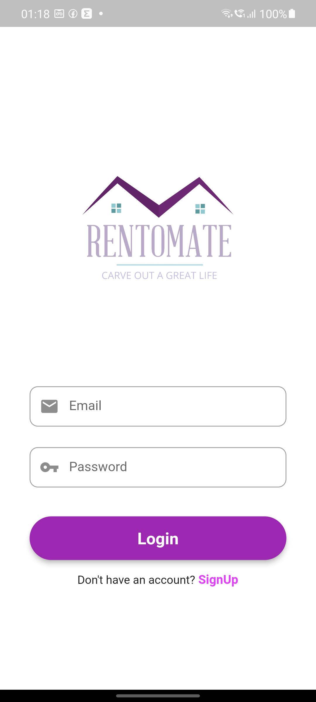
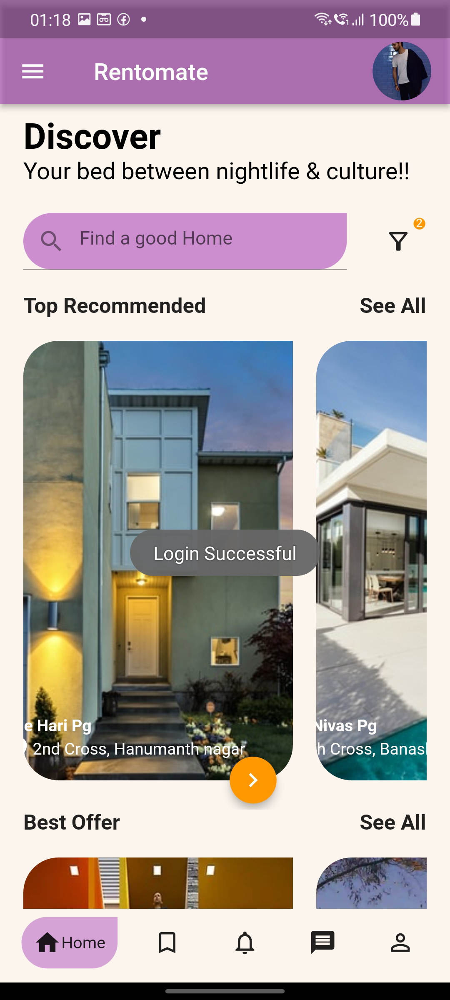
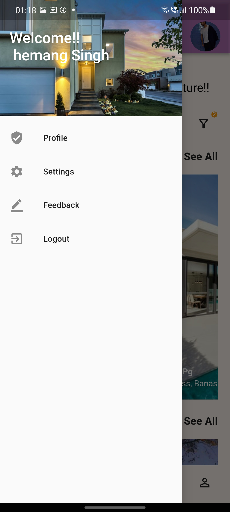
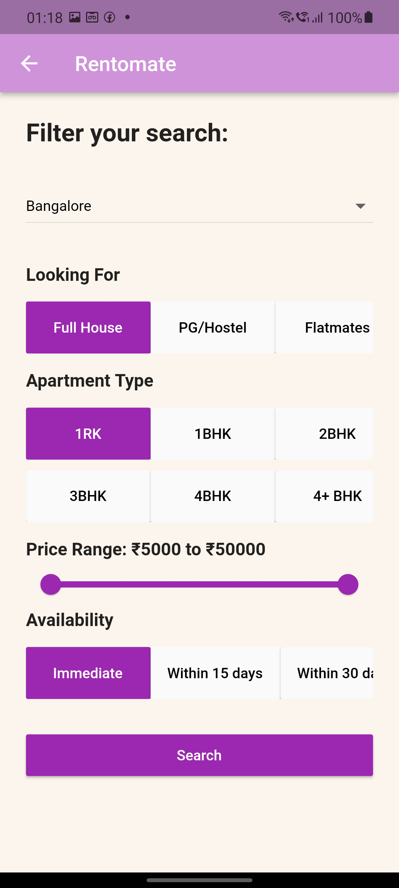
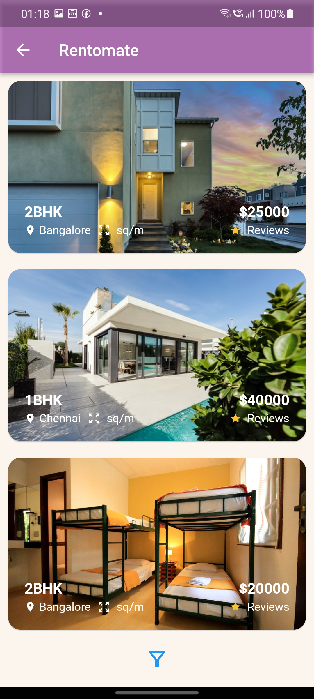

# **Rentomate**

A Fully functional **Tenant Finder app** written in flutter and dart using Firebase as backend.

## **Demo**

<p align="center">

<h3 align="center"><a href="https://drive.google.com/file/d/1HC3-CFecIDVadUDefY1WIFpgt-LfImYB/view?usp=sharing">Download the release APK</a></h3>
</p>


## Screenshots
<hr/>
<p align="center">
   <br>  
</p>

### Clone this repository

```bash
$ git clone https://github.com/Hemang14/Rentomate-App.git
```

### Go into the repository

```bash
$ cd Rentomate-App
```


### Install dependencies

```bash
$ flutter packages get
```

### Run the app

```bash
$ flutter run
```
